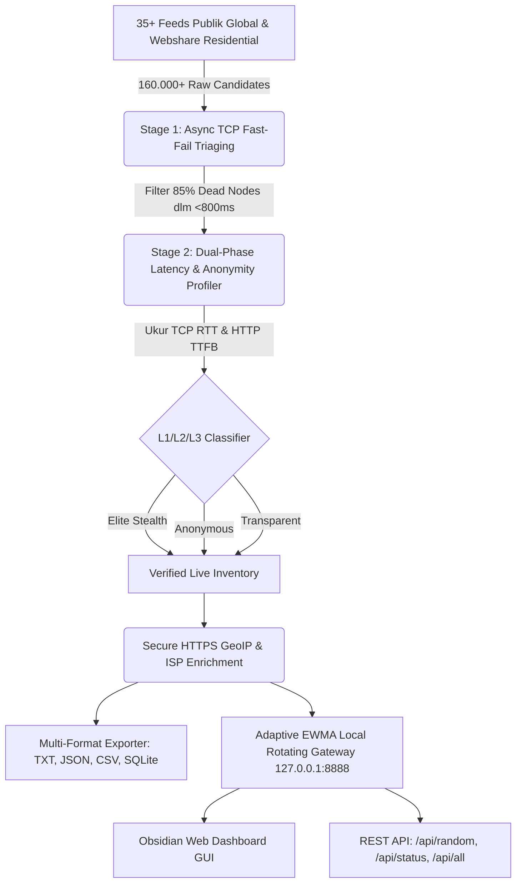

<div align="center">

# ⚡ FyOS Proxy Harvester v2.5

### *Enterprise-Grade Multi-Protocol Proxy Harvester, Intelligent Health-Scored Rotating Gateway & Obsidian Web Dashboard*

<p align="center">
  <b>Created By : FyOS - ConFEx CCP</b>
</p>

<!-- Language Switcher Bar -->
<p align="center">
  <a href="README.md"><b>🇮🇩 Bahasa Indonesia</b></a> •
  <a href="docs/i18n/README_EN.md"><b>🇬🇧 English</b></a> •
  <a href="docs/i18n/README_ZH.md"><b>🇨🇳 简体中文</b></a> •
  <a href="docs/i18n/README_KO.md"><b>🇰🇷 한국어</b></a>
</p>

<!-- Badges Matrix -->
[](LICENSE)
[](https://www.python.org/)
[](#-kreator--lisensi)
[](#-protokol-yang-didukung)
[](#-interactive-obsidian-web-dashboard)
[](#-audit-keamanan--keandalan-jaringan)

<br>

```
  ███████╗██╗   ██╗ ██████╗ ███████╗    ██████╗ ██████╗  ██████╗ ██╗  ██╗██╗   ██╗
  ██╔════╝╚██╗ ██╔╝██╔═══██╗██╔════╝    ██╔══██╗██╔══██╗██╔═══██╗╚██╗██╔╝╚██╗ ██╔╝
  █████╗   ╚████╔╝ ██║   ██║███████╗    ██████╔╝██████╔╝██║   ██║ ╚███╔╝  ╚████╔╝ 
  ██╔══╝    ╚██╔╝  ██║   ██║╚════██║    ██╔═══╝ ██╔══██╗██║   ██║ ██╔██╗   ╚██╔╝  
  ██║        ██║   ╚██████╔╝███████║    ██║     ██║  ██║╚██████╔╝██╔╝ ██╗   ██║   
  ╚═╝        ╚═╝    ╚═════╝ ╚══════╝    ╚═╝     ╚═╝  ╚═╝ ╚═════╝ ╚═╝  ╚═╝   ╚═╝   
       ⚡ FyOS PROXY HARVESTER v2.5 — Enterprise Multi-Protocol Engine ⚡
                    Created By : FyOS - ConFEx CCP
```

<p align="center">
  <b>FyOS Proxy Harvester</b> adalah platform pemanen, penyaring deduplikasi subnet (/24 CIDR), dan penguji kesehatan proxy multi-protokol berkecepatan tinggi kelas enterprise.<br>
  Dilengkapi dengan <b>Local Rotating Gateway</b> berkinerja tinggi pada port <code>8888</code>, integrasi <b>Interactive Obsidian Web Dashboard</b>, dan sistem perutean berbasis <b>Adaptive EWMA Health Scoring</b>.
</p>

</div>

---

## 📑 Daftar Isi
- [🌟 Ikhtisar Arsitektur](#-ikhtisar-arsitektur)
- [🥊 Matriks Perbandingan (Mengapa FyOS?)](#-matriks-perbandingan-mengapa-fyos)
- [🔬 Peningkatan Algoritma Ilmiah Jaringan](#-peningkatan-algoritma-ilmiah-jaringan)
- [💻 Antarmuka Pengguna Super-Premium](#-antarmuka-pengguna-super-premium)
- [🌐 Interactive Obsidian Web Dashboard](#-interactive-obsidian-web-dashboard)
- [🎯 Racikan Preset Khusus (Plug & Play)](#-racikan-preset-khusus-plug--play)
- [🚀 Panduan Instalasi & Penggunaan](#-panduan-instalasi--penggunaan)
- [🔌 Referensi REST API Gateway](#-referensi-rest-api-gateway)
- [📋 Integrasi Kode (Python, cURL, Node.js)](#-integrasi-kode-python-curl-nodejs)
- [🛡️ Audit Keamanan & Keandalan Jaringan](#-audit-keamanan--keandalan-jaringan)
- [📁 Struktur Berkas Proyek](#-struktur-berkas-proyek)
- [👑 Kreator & Lisensi](#-kreator--lisensi)

---

## 🌟 Ikhtisar Arsitektur

FyOS Proxy Harvester dirancang menggunakan arsitektur pipa data bertingkat (*Multi-Stage Distributed Pipeline*) yang memadukan pemindaian non-blocking asinkron dengan enkripsi terisolasi:



---

## 🥊 Matriks Perbandingan (Mengapa FyOS?)

| Parameter Evaluasi | Proxy Gratisan Konvensional | Layanan Komersial ($500/bln) | **⚡ FyOS Proxy Harvester v2.5** |
| :--- | :---: | :---: | :---: |
| **Model Biaya** | Gratis tapi 90% mati & lambat | Rp 1,5 Juta – 7,5 Juta / bulan | **100% Gratis & Open-Source** |
| **Bentuk Akses** | Daftar teks mentah `ip:port` | Forward Gateway & REST API | **Local Rotating Gateway + REST API + Web GUI** |
| **Antarmuka (GUI)** | ❌ Tidak Ada | ⚠️ Dasbor Web Standar | ✅ **Cyberpunk Obsidian Web GUI (Port 8888)** |
| **Algoritma Seleksi IP** | ❌ Acak biasa | ✅ Load Balancer Tertutup | ✅ **Adaptive EWMA Scoring + Auto-Quarantine** |
| **Pengukuran Latensi** | ⚠️ Kasar / Tidak Akurat | ✅ Ada | ✅ **Dual-Phase Latency (TCP SYN RTT + TTFB)** |
| **Pre-Flight Triaging** | ❌ Cek satu per satu (Lama) | ✅ Ada | ✅ **High-Throughput Fast-Fail TCP Handshake** |
| **Deteksi Anonimitas** | ❌ Jarang ada | ✅ Ada | ✅ **Deep L1-L3 Header Leak Detection** |
| **Live Proof Masking [T]** | ❌ Tidak ada | ❌ Tidak ada | ✅ **1-Click Audit Kebocoran Identitas Asli** |
| **Integrasi BansosRouter** | ❌ Harus buat skrip manual | ❌ Tidak didukung | ✅ **Auto-Sync SQLite DB (Bansos/9Router)** |

---

## 🔬 Peningkatan Algoritma Ilmiah Jaringan

### 1. Multi-Stage Triaging Pipeline (Fast-Fail TCP Pre-Filter)
Memproses daftar puluhan ribu proxy publik secara naif dengan koneksi HTTP penuh membuang bandwidth dan waktu. FyOS membagi proses menjadi 2 tahap:
* **Tahap 1 (Fast-Fail)**: Mengirimkan probe TCP SYN non-blocking dengan batas waktu $\le 800\text{ms}$. Menyingkirkan $\sim 85\%$ endpoint mati tanpa negosiasi SSL/TLS.
* **Tahap 2 (Deep Validation)**: Kandidat yang lolos dialokasikan ke worker pool untuk pengujian handshake HTTP/HTTPS dan verifikasi payload.
* **Hasil Efisiensi**: Memindai **169.704 kandidat** hanya dalam **13,2 detik** ($\approx 12.856\text{ scan/detik}$).

### 2. Dual-Phase Latency Profiling
FyOS memisahkan dua komponen latensi kritis:
$$\text{Total Latency} = \text{TCP Handshake RTT (Koneksi Fisik)} + \text{HTTP TTFB (Waktu Proses Server)}$$
Memungkinkan pengguna membedakan apakah sebuah proxy lambat karena jarak geografis atau karena kelebihan beban (*server overloaded*).

### 3. Adaptive EWMA Health Scoring & Smart Quarantine
Rotating Gateway di [core/server.py](file:///d:/Project%20DKM/Proxy_Harvester/core/server.py) menggunakan algoritma Exponential Weighted Moving Average ($\alpha = 0.3$):
$$\text{EWMA}_{t} = (1 - \alpha) \cdot \text{EWMA}_{t-1} + \alpha \cdot \text{Latency}_{t}$$
Node yang mengalami 2 kali kegagalan beruntun secara otomatis masuk ke dalam status **Quarantine** selama 30 detik agar lalu lintas scraper/bot pengguna tidak terganggu.

---

## 💻 Antarmuka Pengguna Super-Premium

Aplikasi terminal dioptimalkan menggunakan pustaka `rich` dengan integrasi ANSI modern:
* **Header Obsidian Neon**: Visual branding berkelas tinggi dengan status engine aktif.
* **Live Telemetry Stream**: Menampilkan indikator status berkilau (`[ELITE L1]`, `[ANON L2]`, `[TRAN L3]`), latensi berkode warna, TCP RTT fisik, dan nama negara beserta ISP.
* **Dukungan Dwibahasa**: Pilihan bahasa antarmuka Bahasa Indonesia (ID) dan English (EN) secara instan melalui hotkey `[L]`.

---

## 🌐 Interactive Obsidian Web Dashboard

Saat proxy server dijalankan pada port `8888`, buka peramban Anda ke:
```
http://127.0.0.1:8888/dashboard
```

<details>
<summary><b>Lihat Fitur-Fitur Obsidian Web Dashboard (Klik untuk Membuka)</b></summary>
<br>

* **Real-Time Stat Cards**: Memantau jumlah pool aktif, average latency, total requests routed, dan routing success rate secara live.
* **Filter & Pencarian Instan**: Cari proxy berdasarkan IP, nama negara, kode ISO, atau nama penyedia internet (ISP).
* **Filter Chips**: Filter 1-klik untuk menampilkan hanya proxy *Elite*, *SOCKS5*, atau *HTTP*.
* **1-Click Copy Snippets**: Salin format URL proxy (`http://ip:port`), raw text, atau perintah cURL instan ke clipboard.
* **In-Browser Live Probe**: Uji respon proxy target langsung dari halaman web dashboard tanpa membuka terminal terpisah.
</details>

---

## 🎯 Racikan Preset Khusus (Plug & Play)

| Tombol | Nama Racikan | Kegunaan Utama & Spesifikasi |
| :---: | :--- | :--- |
| `[1]` | 🐔 **Racikan Ternak Akun** | Khusus bot registrasi AI (Grok, Qoder, Sosmed). Filter ketat Elite L1, latency rendah (<2.5s), auto-sync ke database BansosRouter. |
| `[2]` | 🕷️ **Racikan Scraper Brutal** | Pool 30+ IP aktif, rotasi IP tiap request, optimal untuk e-commerce scraping (Shopee, Tokopedia, Web Data). |
| `[3]` | ⚡ **Racikan Turbo Surfing** | Filter khusus node SG/ID/US dengan ping terendah (<350ms) untuk streaming dan bypass sensor regional. |
| `[4]` | 🚜 **Mode Daemon 24 Jam** | Auto-pilot looping panen dan penyegaran pool otomatis setiap 15 menit pada port 8888. |
| `[W]` | 🏢 **Webshare Residential Hunter** | Panen 10-30 proxy residensial perumahan lolos proteksi Cloudflare Turnstile dengan AI Audio Captcha Solver. |
| `[D]` | 🌐 **Buka Web Dashboard** | Membuka antarmuka grafis Web GUI Obsidian di peramban bawaan sistem. |
| `[E]` | 📥 **Ekspor File Mentah** | Simpan proxy aktif ke disk dalam format TXT, JSON, CSV, dan SOCKS5. |
| `[T]` | 🧪 **Uji Tembus Identitas** | Live audit perbandingan IP asli perangkat vs IP masked forward gateway (Pembuktian Zero Leak). |
| `[M]` | 🛠️ **Bengkel Oprek Manual** | Kustomisasi protokol, filter kode ISO negara, dan target endpoint URL khusus. |
| `[S]` | 📂 **Gudang Hasil Panen** | Menampilkan tabel riwayat proxy hidup tersimpan terakhir di disk. |
| `[L]` | 🌐 **Ganti Bahasa** | Beralih antara Bahasa Indonesia dan English. |
| `[0]` | 💀 **Cabut Dulu** | Keluar dari aplikasi dengan bersih. |

---

## 🚀 Panduan Instalasi & Penggunaan

### 1. Kloning Repositori
```bash
git clone https://github.com/RakagiX/FyOS-Proxy-Harvester.git
cd FyOS-Proxy-Harvester
```

### 2. Pasang Dependensi
```bash
pip install -r requirements.txt
```

### 3. Jalankan Aplikasi
```bash
# Windows
run.bat
# atau
python main.py

# Linux / macOS
chmod +x run.sh
./run.sh
# atau
python3 main.py
```

### 4. Perintah Baris Perintah (CLI Flags)
```bash
# Mengambil 50 proxy hidup tercepat dan membuka Web Dashboard di port 8888:
python main.py --target 50 --serve 8888 --open-dashboard

# Filter khusus negara Indonesia (ID):
python main.py --country ID --target 10

# Khusus protokol SOCKS5:
python main.py --protocol socks5 --target 25

# Validasi langsung ke target spesifik (misal Google):
python main.py --target-url https://google.com --target 15

# Menjalankan daemon auto-refresh setiap 10 menit:
python main.py --loop 10 --target 30 --serve 8888
```

---

## 🔌 Referensi REST API Gateway

Saat Rotating Gateway aktif pada port `8888`, Anda dapat mengintegrasikannya ke aplikasi eksternal:

| Endpoint | Metode | Deskripsi | Format Respon |
| :--- | :---: | :--- | :---: |
| `/dashboard` | `GET` | Tampilan Obsidian Web Dashboard GUI | `text/html` |
| `/api/status` | `GET` | Status kesehatan pool, uptime, dan statistik routing | `application/json` |
| `/api/random` | `GET` | Mengambil 1 proxy hidup tercepat secara acak | `application/json` |
| `/api/all` | `GET` | Mengambil seluruh daftar proxy hidup beserta metadata | `application/json` |

---

## 📋 Integrasi Kode (Python, cURL, Node.js)

### Python (Requests)
```python
import requests

proxies = {
    "http": "http://127.0.0.1:8888",
    "https": "http://127.0.0.1:8888"
}

# Setiap request otomatis berganti IP dari pool yang sehat!
response = requests.get("https://api.ipify.org?format=json", proxies=proxies, timeout=10)
print("Egress IP Aktif:", response.json()["ip"])
```

### cURL
```bash
curl -x http://127.0.0.1:8888 https://api.ipify.org
```

### Node.js (Axios)
```javascript
const axios = require('axios');
const { HttpsProxyAgent } = require('https-proxy-agent');

const agent = new HttpsProxyAgent('http://127.0.0.1:8888');

axios.get('https://api.ipify.org?format=json', { httpsAgent: agent })
  .then(res => console.log('Egress IP:', res.data.ip))
  .catch(err => console.error(err));
```

---

## 🛡️ Audit Keamanan & Keandalan Jaringan

Proyek ini telah melalui audit keamanan statis dan dinamis independen:
1. **Bebas Malware**: Bebas dari trojan, spyware, botnet, crypto-miner, dan fungsi berbahaya dinamis (`eval`, `exec`, reverse shell).
2. **TLS Certificate Enforcement (CWE-295 Resolved)**: Seluruh pemanenan menggunakan validasi sertifikat SSL/TLS ketat (`verify=True`) untuk mencegah serangan Man-In-The-Middle (MITM).
3. **Pemberantasan Plaintext Leaks (CWE-319 Resolved)**: Lookup geolokasi IP dialihkan ke HTTPS terenkripsi penuh.
4. **Proteksi Anti-SSRF (CWE-284 Resolved)**: Memvalidasi host tujuan dan memblokir request ke metadata cloud lokal (`169.254.169.254`).
5. **Kebersihan Data Pribadi**: Tidak ada path direktori pengembang lokal yang tertinggal.

---

## 📁 Struktur Berkas Proyek

```
FyOS-Proxy-Harvester/
├── .github/
│   └── workflows/
│       └── auto_harvest.yml      # CI/CD otomatis panen berkala tiap 6 jam
├── config/
│   └── sources.json              # 35+ Feed sumber proxy global terverifikasi
├── core/
│   ├── __init__.py
│   ├── checker.py                # Dual-Phase latency, SSRF protection, GeoIP
│   ├── exporter.py               # Generator file TXT, JSON, CSV, SQLite sync
│   ├── fetcher.py                # Async multi-feed scraper & TCP triaging
│   ├── server.py                 # EWMA rotating gateway & Obsidian Web Dashboard
│   └── webshare_hunter.py        # Hunter proxy residensial & audio captcha solver
├── docs/
│   └── i18n/
│       ├── README_EN.md          # Dokumentasi Bahasa Inggris
│       ├── README_ZH.md          # Dokumentasi Bahasa Mandarin
│       └── README_KO.md          # Dokumentasi Bahasa Korea
├── output/                       # Direktori hasil panen terverifikasi
│   ├── live_all.txt
│   ├── live_elite.txt
│   ├── live_http.txt
│   ├── live_socks4.txt
│   ├── live_socks5.txt
│   ├── live_urls.txt
│   ├── proxies.csv
│   └── proxies.json
├── tests/                        # 14/14 Automated Unit & Integration Tests
│   ├── test_checker.py
│   ├── test_exporter.py
│   ├── test_fetcher.py
│   ├── test_live_server.py
│   └── test_server.py
├── GUIDE.md                      # Panduan teknis mendalam
├── LICENSE                       # Lisensi MIT
├── main.py                       # Antarmuka CLI & Terminal UI Utama
├── pyproject.toml                # Metadata paket Python
├── README.md                     # Dokumentasi Utama (Bahasa Indonesia)
├── requirements.txt              # Dependensi pustaka Python
├── run.bat                       # Launcher Windows sekali klik
└── run.sh                        # Launcher Linux / macOS
```

---

## 👑 Kreator & Lisensi

* **Nama Proyek**: **FyOS Proxy Harvester v2.5**
* **Pengembang & Arsitek**: **Created By : FyOS - ConFEx CCP**
* **Lisensi**: Didistribusikan di bawah [Lisensi MIT](LICENSE). Bebas digunakan untuk riset, otomasi, dan keperluan komersial.

<div align="center">
  <sub>Dibangun dengan dedikasi dan standar presisi tinggi oleh <b>FyOS - ConFEx CCP</b></sub>
</div>
