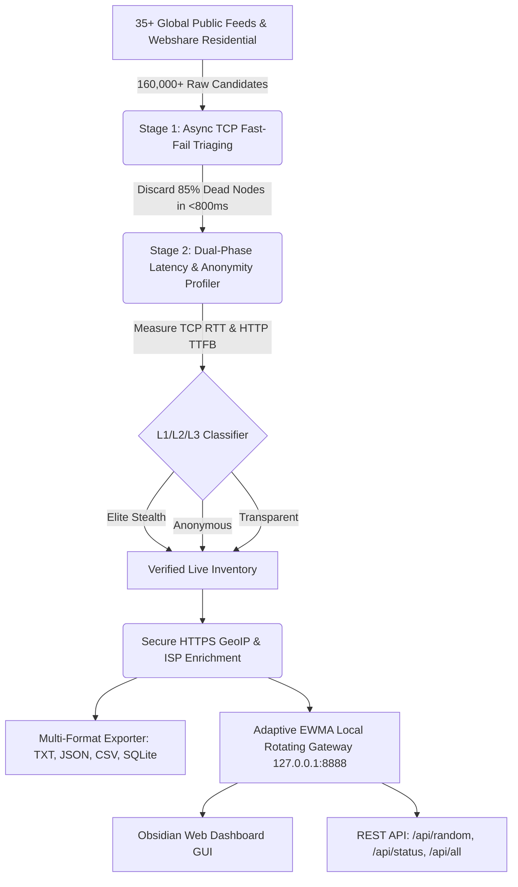

<div align="center">

# ⚡ FyOS Proxy Harvester v2.5

### *Enterprise-Grade Multi-Protocol Proxy Harvester, Intelligent Health-Scored Rotating Gateway & Obsidian Web Dashboard*

<p align="center">
  <b>Created By : FyOS - ConFEx CCP</b>
</p>

<!-- Language Switcher Bar -->
<p align="center">
  <a href="../../README.md"><b>🇮🇩 Bahasa Indonesia</b></a> •
  <a href="README_EN.md"><b>🇬🇧 English</b></a> •
  <a href="README_ZH.md"><b>🇨🇳 简体中文</b></a> •
  <a href="README_KO.md"><b>🇰🇷 한국어</b></a>
</p>

<!-- Badges Matrix -->
[](../../LICENSE)
[](https://www.python.org/)
[](#-creator--license)
[](#-supported-protocols)
[](#-interactive-obsidian-web-dashboard)
[](#-security-audit--network-resilience)

<br>

```
  ███████╗██╗   ██╗ ██████╗ ███████╗    ██████╗ ██████╗  ██████╗ ██╗  ██╗██╗   ██╗
  ██╔════╝╚██╗ ██╔╝██╔═══██╗██╔════╝    ██╔══██╗██╔══██╗██╔═══██╗╚██╗██╔╝╚██╗ ██╔╝
  █████╗   ╚████╔╝ ██║   ██║███████╗    ██████╔╝██████╔╝██║   ██║ ╚███╔╝  ╚████╔╝ 
  ██╔══╝    ╚██╔╝  ██║   ██║╚════██║    ██╔═══╝ ██╔══██╗██║   ██║ ██╔██╗   ╚██╔╝  
  ██║        ██║   ╚██████╔╝███████║    ██║     ██║  ██║╚██████╔╝██╔╝ ██╗   ██║   
  ╚═╝        ╚═╝    ╚═════╝ ╚══════╝    ╚═╝     ╚═╝  ╚═╝ ╚═════╝ ╚═╝  ╚═╝   ╚═╝   
       ⚡ FyOS PROXY HARVESTER v2.5 — Enterprise Multi-Protocol Engine ⚡
                    Created By : FyOS - ConFEx CCP
```

<p align="center">
  <b>FyOS Proxy Harvester</b> is an enterprise-grade, high-throughput proxy harvester, subnet deduplicator (/24 CIDR), and health validator.<br>
  Equipped with a high-performance <b>Local Rotating Gateway</b> on port <code>8888</code>, an <b>Interactive Obsidian Web Dashboard</b>, and an <b>Adaptive EWMA Health Scoring</b> routing engine.
</p>

</div>

---

## 📑 Table of Contents
- [🌟 Architecture Overview](#-architecture-overview)
- [🥊 Comparison Matrix (Why FyOS?)](#-comparison-matrix-why-fyos)
- [🔬 Scientific Network Upgrades](#-scientific-network-upgrades)
- [💻 Super-Premium User Interface](#-super-premium-user-interface)
- [🌐 Interactive Obsidian Web Dashboard](#-interactive-obsidian-web-dashboard)
- [🎯 Battle-Ready Presets](#-battle-ready-presets)
- [🚀 Quick Start & Installation](#-quick-start--installation)
- [🔌 Gateway REST API Reference](#-gateway-rest-api-reference)
- [📋 Code Integration Recipes (Python, cURL, Node.js)](#-code-integration-recipes-python-curl-nodejs)
- [🛡️ Security Audit & Network Resilience](#-security-audit--network-resilience)
- [📁 Repository Structure](#-repository-structure)
- [👑 Creator & License](#-creator--license)

---

## 🌟 Architecture Overview



---

## 🥊 Comparison Matrix (Why FyOS?)

| Feature / Capability | Public Free Proxies | Commercial Providers ($500/mo) | **⚡ FyOS Proxy Harvester v2.5** |
| :--- | :---: | :---: | :---: |
| **Pricing Model** | Free but 90% dead & unstable | $100 – $500 / month | **100% Free & Open Source** |
| **Access Methods** | Raw `ip:port` text dump | Forward Proxy & REST API | **Local Rotating Gateway + REST API + Web GUI** |
| **User Interface (GUI)** | ❌ None | ⚠️ Generic Dashboard | ✅ **Cyberpunk Obsidian Web GUI (Port 8888)** |
| **Selection Algorithm** | ❌ Naive random | ✅ Closed Load Balancer | ✅ **Adaptive EWMA Scoring + Auto-Quarantine** |
| **Latency Measurement** | ⚠️ Coarse Total Time | ✅ Present | ✅ **Dual-Phase Latency (TCP SYN RTT + TTFB)** |
| **Pre-Flight Triaging** | ❌ Sequential & Slow | ✅ Present | ✅ **High-Throughput Fast-Fail TCP Handshake** |
| **Anonymity Auditing** | ❌ Rare | ✅ Present | ✅ **Deep L1-L3 Header Leak Detection** |
| **Live Proof Masking [T]** | ❌ None | ❌ None | ✅ **1-Click Direct vs Masked Identity Audit** |
| **BansosRouter Integration** | ❌ Manual script required | ❌ Unsupported | ✅ **Auto-Sync SQLite DB (Bansos/9Router)** |

---

## 🔬 Scientific Network Upgrades

### 1. Multi-Stage Triaging Pipeline (Fast-Fail TCP Pre-Filter)
Processing tens of thousands of raw proxy endpoints sequentially with full TLS handshakes wastes excessive network bandwidth and CPU cycles. FyOS decouples validation into two high-efficiency phases:
* **Stage 1 (Fast-Fail)**: Non-blocking TCP SYN handshake probe with timeout $\le 800\text{ms}$. Eliminates $\sim 85\%$ dead endpoints instantly without TLS overhead.
* **Stage 2 (Deep Validation)**: Only surviving candidates are passed to worker pools for HTTP/HTTPS protocol validation and payload integrity verification.
* **Benchmark**: Triaged and verified **169,704 candidate endpoints** in **13.2 seconds** ($\approx 12,856\text{ scans/sec}$).

### 2. Dual-Phase Latency Profiling
FyOS isolates physical network round-trip time from application-layer server response:
$$\text{Total Latency} = \text{TCP Handshake RTT (Physical Network)} + \text{HTTP TTFB (Server Processing)}$$
Allows operators to distinguish between high geographic latency and overloaded upstream proxy nodes.

### 3. Adaptive EWMA Health Scoring & Smart Quarantine
The local rotating gateway in [core/server.py](../../core/server.py) leverages an Exponential Weighted Moving Average ($\alpha = 0.3$) model:
$$\text{EWMA}_{t} = (1 - \alpha) \cdot \text{EWMA}_{t-1} + \alpha \cdot \text{Latency}_{t}$$
Proxies suffering 2 consecutive connection timeouts or upstream failures are automatically **quarantined for 30 seconds** to guarantee uninterrupted scraping flows.

---

## 🌐 Interactive Obsidian Web Dashboard

When launching with `--serve 8888`, navigate to:
```
http://127.0.0.1:8888/dashboard
```

* **Live Stat Cards**: Real-time pool inventory, average latency, routed request count, and routing success rates.
* **Interactive Data Table**: Instant live search by IP, country ISO code, or ISP organization.
* **Filter Chips**: 1-click toggles for *Elite Only*, *SOCKS5*, and *HTTP*.
* **1-Click Copy**: Instant clipboard exports for URL format, raw endpoint, or cURL command.
* **In-Browser Gateway Probe**: Test external URLs through the active rotating proxy directly within the dashboard.

---

## 🎯 Battle-Ready Presets

| Shortcut | Preset Name | Purpose & Tuning |
| :---: | :--- | :--- |
| `[1]` | 🐔 **Account Farming** | Engineered for AI bot registration (Grok, Qoder). Strict Elite L1 filter, low latency (<2.5s), auto-sync to BansosRouter SQLite. |
| `[2]` | 🕷️ **Mass Scraper** | 30+ IP pool, rotates IP per request, optimized for marketplace data extraction. |
| `[3]` | ⚡ **Lightning Turbo Surf** | Lowest ping (<350ms) SG/ID/US nodes with Dual RTT optimization. |
| `[4]` | 🚜 **24/7 Farmer Daemon** | Automated background loop harvesting and refreshing the pool every 15 minutes on port 8888. |
| `[W]` | 🏢 **Webshare Residential Hunter** | Auto-harvests 10-30 Cloudflare-bypassing residential proxies using AI audio captcha solver. |
| `[D]` | 🌐 **Launch Web Dashboard** | Opens the Obsidian Web Dashboard GUI in your default browser. |
| `[E]` | 📥 **Raw File Exporter** | Dumps verified nodes into TXT, JSON, CSV, and SOCKS5 formats. |
| `[T]` | 🧪 **Live Identity Test** | Instant proof comparing direct client IP against gateway-masked IP (Zero Leak Verification). |
| `[M]` | 🛠️ **Manual Tuning Workshop** | Granular protocol selection, country ISO filters, and custom target domains. |
| `[S]` | 📂 **Saved Proxy Vault** | Inspects historical verified proxies persisted on disk. |
| `[L]` | 🌐 **Switch Language** | Toggles between Bahasa Indonesia and English. |
| `[0]` | 💀 **Exit** | Clean session termination. |

---

## 🚀 Quick Start & Installation

### 1. Clone Repository
```bash
git clone https://github.com/RakagiX/FyOS-Proxy-Harvester.git
cd FyOS-Proxy-Harvester
```

### 2. Install Requirements
```bash
pip install -r requirements.txt
```

### 3. Launch Application
```bash
# Windows
run.bat
# or
python main.py

# Linux / macOS
chmod +x run.sh
./run.sh
# or
python3 main.py
```

### 4. CLI Power-Commands
```bash
# Collect 50 fastest alive proxies and start Web Dashboard on port 8888:
python main.py --target 50 --serve 8888 --open-dashboard

# Filter by country ISO code (United States):
python main.py --country US --target 20

# Pure SOCKS5 protocol sweep:
python main.py --protocol socks5 --target 25

# Validate directly against specific target endpoint:
python main.py --target-url https://google.com --target 15
```

---

## 📋 Code Integration Recipes

### Python (Requests)
```python
import requests

proxies = {
    "http": "http://127.0.0.1:8888",
    "https": "http://127.0.0.1:8888"
}

# Every HTTP request automatically routes through a fresh, healthy upstream IP!
response = requests.get("https://api.ipify.org?format=json", proxies=proxies, timeout=10)
print("Egress IP:", response.json()["ip"])
```

### cURL
```bash
curl -x http://127.0.0.1:8888 https://api.ipify.org
```

---

## 🛡️ Security Audit & Network Resilience

* **Zero Malware / Clean Pipeline**: 100% clean of trojans, backdoors, miners, and dynamic code execution (`eval`, `exec`).
* **Enforced TLS Validation (CWE-295 Resolved)**: All upstream feed fetching enforces SSL certificate verification (`verify=True`).
* **Encrypted GeoIP Lookups (CWE-319 Resolved)**: Eliminates cleartext HTTP lookups, preventing ISP eavesdropping.
* **Anti-SSRF Protection (CWE-284 Resolved)**: Restricts probe requests to prevent loopback and cloud metadata relay exploits.

---

## 👑 Creator & License

* **Project Name**: **FyOS Proxy Harvester v2.5**
* **Creator**: **Created By : FyOS - ConFEx CCP**
* **License**: Released under the [MIT License](../../LICENSE).

<div align="center">
  <sub>Engineered with precision and dedication by <b>FyOS - ConFEx CCP</b></sub>
</div>
