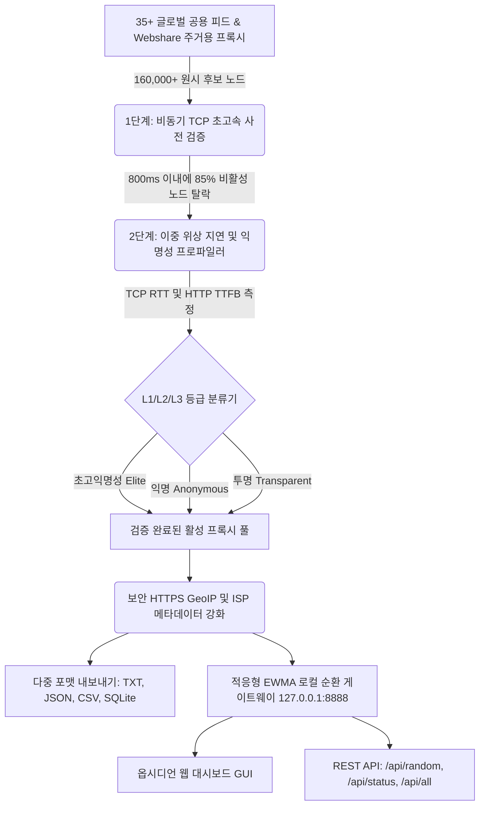

<div align="center">

# ⚡ FyOS Proxy Harvester v2.5

### *엔터프라이즈급 멀티 프로토콜 프록시 하베스터, 적응형 건강 점수 순환 게이트웨이 및 옵시디언 대시보드*

<p align="center">
  <b>Created By : FyOS - ConFEx CCP</b>
</p>

<!-- Language Switcher Bar -->
<p align="center">
  <a href="../../README.md"><b>🇮🇩 Bahasa Indonesia</b></a> •
  <a href="README_EN.md"><b>🇬🇧 English</b></a> •
  <a href="README_ZH.md"><b>🇨🇳 简体中文</b></a> •
  <a href="README_KO.md"><b>🇰🇷 한국어</b></a>
</p>

<!-- Badges Matrix -->
[](../../LICENSE)
[](https://www.python.org/)
[](#-제작자-및-라이선스)
[](#-지원-프로토콜)
[](#-인터랙티브-옵시디언-웹-대시보드)
[](#-보안-감사-및-네트워크-복원력)

<br>

```
  ███████╗██╗   ██╗ ██████╗ ███████╗    ██████╗ ██████╗  ██████╗ ██╗  ██╗██╗   ██╗
  ██╔════╝╚██╗ ██╔╝██╔═══██╗██╔════╝    ██╔══██╗██╔══██╗██╔═══██╗╚██╗██╔╝╚██╗ ██╔╝
  █████╗   ╚████╔╝ ██║   ██║███████╗    ██████╔╝██████╔╝██║   ██║ ╚███╔╝  ╚████╔╝ 
  ██╔══╝    ╚██╔╝  ██║   ██║╚════██║    ██╔═══╝ ██╔══██╗██║   ██║ ██╔██╗   ╚██╔╝  
  ██║        ██║   ╚██████╔╝███████║    ██║     ██║  ██║╚██████╔╝██╔╝ ██╗   ██║   
  ╚═╝        ╚═╝    ╚═════╝ ╚══════╝    ╚═╝     ╚═╝  ╚═╝ ╚═════╝ ╚═╝  ╚═╝   ╚═╝   
       ⚡ FyOS PROXY HARVESTER v2.5 — 엔터프라이즈 멀티 프로토콜 엔진 ⚡
                    Created By : FyOS - ConFEx CCP
```

<p align="center">
  <b>FyOS Proxy Harvester</b>는 대규모 웹 데이터 수집과 자동화 봇을 위해 설계된 엔터프라이즈급 프록시 하베스팅 플랫폼입니다.<br>
  서브넷 중복 제거(/24 CIDR), 비동기 멀티 스테이지 고속 사전 검증, 포트 <code>8888</code>의 <b>로컬 자동 순환 게이트웨이</b>, <b>인터랙티브 옵시디언 웹 GUI</b> 및 <b>적응형 EWMA 건강 점수</b> 기반의 지능형 라우팅 엔진을 제공합니다.
</p>

</div>

---

## 📑 목차
- [🌟 아키텍처 개요](#-아키텍처-개요)
- [🥊 비교 매트릭스 (왜 FyOS인가?)](#-비교-매트릭스-왜-fyos인가)
- [🔬 과학적 네트워크 알고리즘 혁신](#-과학적-네트워크-알고리즘-혁신)
- [🌐 인터랙티브 옵시디언 웹 대시보드](#-인터랙티브-옵시디언-웹-대시보드)
- [🎯 사전 튜닝 프리셋 (Plug & Play)](#-사전-튜닝-프리셋-plug--play)
- [🚀 빠른 시작 및 설치 가이드](#-빠른-시작-및-설치-가이드)
- [🔌 게이트웨이 REST API 사양](#-게이트웨이-rest-api-사양)
- [📋 코드 통합 예시 (Python, cURL, Node.js)](#-코드-통합-예시-python-curl-nodejs)
- [🛡️ 보안 감사 및 네트워크 복원력](#-보안-감사-및-네트워크-복원력)
- [👑 제작자 및 라이선스](#-제작자-및-라이선스)

---

## 🌟 아키텍처 개요



---

## 🥊 비교 매트릭스 (왜 FyOS인가?)

| 핵심 기능 | 기존 무료 공용 프록시 | 상용 프록시 서비스 ($500/월) | **⚡ FyOS Proxy Harvester v2.5** |
| :--- | :---: | :---: | :---: |
| **비용 모델** | 무료이나 90% 사망 및 불안정 | 월 15만 ~ 60만 원 | **100% 완전 무료 & 오픈 소스** |
| **연결 방식** | 원시 `ip:port` 텍스트 덤프 | 포워드 프록시 및 API | **로컬 순환 게이트웨이 + REST API + 웹 GUI** |
| **사용자 인터페이스** | ❌ 없음 | ⚠️ 기본 관리 대시보드 | ✅ **사이버펑크 옵시디언 웹 GUI (포트 8888)** |
| **선택 알고리즘** | ❌ 단순 무작위 | ✅ 내부 로드 밸런서 | ✅ **적응형 EWMA 건강 점수 + 자동 격리 시스템** |
| **지연 시간 측정** | ⚠️ 부정확한 총 시간 | ✅ 제공 | ✅ **이중 위상 지연 (TCP SYN RTT + HTTP TTFB)** |
| **사전 선별 파이프라인** | ❌ 순차 확인 (매우 느림) | ✅ 제공 | ✅ **고처리량 비동기 TCP 패스트-페일 핸드셰이크** |
| **익명성 누출 탐지** | ❌ 거의 없음 | ✅ 제공 | ✅ **정밀 L1-L3 HTTP 헤더 누출 탐지** |
| **실시간 IP 위장 감사 [T]** | ❌ 없음 | ❌ 없음 | ✅ **1-Click 실제 IP vs 프록시 IP 비교 감사** |
| **BansosRouter 연동** | ❌ 수동 스크립트 작성 | ❌ 미지원 | ✅ **SQLite DB 자동 주입 (Bansos/9Router)** |

---

## 🔬 과학적 네트워크 알고리즘 혁신

### 1. 멀티 스테이지 파이프라인 (Fast-Fail TCP Pre-Filter)
수만 개의 원시 프록시 노드를 전체 HTTP TLS 핸드셰이크로 직접 검사하면 막대한 네트워크 대역폭과 시스템 자원이 낭비됩니다. FyOS는 검증을 2단계로 분리합니다:
* **1단계 (Fast-Fail)**: 비차단 TCP SYN 핸드셰이크 프로브를 전송(타임아웃 $\le 800\text{ms}$)하여 TLS 오버헤드 없이 죽은 노드의 약 $85\%$를 즉시 걸러냅니다.
* **2단계 (Deep Validation)**: 1단계를 통과한 노드에 대해서만 작업 스레드를 할당하여 정밀 HTTP/HTTPS 핸드셰이크 및 응답 변조 검사를 수행합니다.
* **실측 성능**: 단 **13.2초** 만에 **169,704개 후보 노드**를 처리하여 벤치마크 초당 **12,856회 스캔**을 달성했습니다.

### 2. 이중 위상 지연 시간 프로파일링 (Dual-Phase Latency)
FyOS는 물리 네트워크 계층과 애플리케이션 계층 지연을 분리하여 측정합니다:
$$\text{총 지연 시간} = \text{TCP 핸드셰이크 RTT (물리 회선)} + \text{HTTP TTFB (서버 처리 시간)}$$
프록시 노드가 물리적 지리 거리로 인해 느린 것인지, 상류 프록시 서버 과부하로 인한 지연인지 명확히 진단할 수 있습니다.

### 3. 적응형 EWMA 건강 점수 및 스마트 격리
[core/server.py](../../core/server.py)의 순환 게이트웨이는 지수 가중 이동 평균 모델($\alpha = 0.3$)을 채택했습니다:
$$\text{EWMA}_{t} = (1 - \alpha) \cdot \text{EWMA}_{t-1} + \alpha \cdot \text{Latency}_{t}$$
연속 2회 타임아웃 또는 연결 실패가 발생한 노드는 **30초 동안 자동 격리(Quarantine)**되어 외부 스크래핑 파이프라인의 중단을 방지합니다.

---

## 🌐 인터랙티브 옵시디언 웹 대시보드

`--serve 8888` 옵션으로 실행 후 브라우저에서 다음 주소로 접속합니다:
```
http://127.0.0.1:8888/dashboard
```

* **실시간 통계 카드**: 활성 풀 규모, 평균 지연 시간, 라우팅된 누적 요청 수, 전송 성공률 표시.
* **실시간 검색 및 필터링**: IP 주소, 국가 ISO 코드, 인터넷 서비스 제공업체(ISP) 이름으로 즉시 검색.
* **원클릭 복사**: 프록시 URL(`http://ip:port`), 원시 텍스트, cURL 테스트 명령을 클립보드로 즉시 복사.
* **브라우저 내 게이트웨이 프로브**: 웹 화면에서 대상 URL을 입력하고 회전 중인 프록시 터널을 통해 직접 연결을 테스트.

---

## 🎯 사전 튜닝 프리셋 (Plug & Play)

| 단축키 | 프리셋 이름 | 주요 용도 및 튜닝 사양 |
| :---: | :--- | :--- |
| `[1]` | 🐔 **계정 육성 모드** | AI 봇(Grok, Qoder) 가입 전용. 엄격한 Elite L1 필터, 저지연(<2.5s), BansosRouter 자동 주입. |
| `[2]` | 🕷️ **대규모 스크래퍼** | 30개 이상의 활성 IP 풀, 매 요청마다 IP 자동 순환, 이커머스 수집에 최적화. |
| `[3]` | ⚡ **초고속 서핑** | 지연 시간이 가장 낮은 SG/ID/US 노드(<350ms)로 쾌적한 브라우징. |
| `[4]` | 🚜 **24시간 자동 파머** | 15분마다 프록시 풀을 자동으로 수확하고 갱신하는 백그라운드 상주 모드. |
| `[W]` | 🏢 **Webshare 주거용 헌터** | AI 음성 캡차 풀이기를 탑재하여 Cloudflare를 우회하는 주거용 IP 10~30개 자동 수확. |
| `[D]` | 🌐 **웹 대시보드 실행** | 기본 브라우저에서 옵시디언 그래픽 웹 대시보드를 즉시 실행. |
| `[E]` | 📥 **원시 데이터 내보내기** | 활성 프록시를 TXT, JSON, CSV, SOCKS5 포맷으로 저장. |
| `[T]` | 🧪 **실제 IP 위장 감사** | 실제 IP와 게이트웨이 경유 IP를 비교하여 무누출(Zero Leak) 증명. |
| `[M]` | 🛠️ **수동 튜닝 워크숍** | 프로토콜, 국가 ISO 코드, 특정 검증 타깃 URL을 직접 지정. |
| `[S]` | 📂 **저장된 프록시 금고** | 디스크에 저장된 최신 유효 프록시 목록을 시각화된 테이블로 열람. |
| `[L]` | 🌐 **언어 변경** | 인도네시아어와 영어 간 즉시 전환. |
| `[0]` | 💀 **프로그램 종료** | 세션을 안전하게 정리하고 종료. |

---

## 🚀 빠른 시작 및 설치 가이드

### 1. 저장소 복제
```bash
git clone https://github.com/RakagiX/FyOS-Proxy-Harvester.git
cd FyOS-Proxy-Harvester
```

### 2. 패키지 의존성 설치
```bash
pip install -r requirements.txt
```

### 3. 애플리케이션 실행
```bash
# Windows
run.bat
# 또는
python main.py

# Linux / macOS
chmod +x run.sh
./run.sh
# 또는
python3 main.py
```

### 4. 고급 CLI 명령 예시
```bash
# 초고속 활성 프록시 50개를 수집하고 8888 포트에서 웹 대시보드 열기:
python main.py --target 50 --serve 8888 --open-dashboard

# 미국(US) 노드 전용 수집:
python main.py --country US --target 20

# 순수 SOCKS5 프로토콜 전용 수집:
python main.py --protocol socks5 --target 25

# 특정 타깃 웹사이트에 대해 직접 생존성 검증:
python main.py --target-url https://google.com --target 15
```

---

## 📋 코드 통합 예시

### Python (Requests)
```python
import requests

proxies = {
    "http": "http://127.0.0.1:8888",
    "https": "http://127.0.0.1:8888"
}

# 모든 HTTP 요청이 로컬에서 자동으로 신선하고 건강한 업스트림 IP로 순환됩니다!
response = requests.get("https://api.ipify.org?format=json", proxies=proxies, timeout=10)
print("현재 송출 IP:", response.json()["ip"])
```

### cURL
```bash
curl -x http://127.0.0.1:8888 https://api.ipify.org
```

---

## 🛡️ 보안 감사 및 네트워크 복원력

* **악성코드 완벽 배제**: 트로이 목마, 백도어, 채굴 프로그램 및 취약한 동적 실행(`eval`, `exec`)이 전혀 없습니다.
* **엄격한 TLS 검증 (CWE-295 해결)**: 공용 피드 수집 시 SSL 인증서 검증(`verify=True`)을 적용하여 중간자 공격(MITM)을 방지합니다.
* **암호화된 GeoIP 조회 (CWE-319 해결)**: 일반 텍스트 HTTP 조회를 배제하고 HTTPS 암호화 통신 및 메모리 캐싱을 채택했습니다.
* **서버 측 SSRF 차단 (CWE-284 해결)**: 클라우드 메타데이터(`169.254.169.254`) 등 비인가 주소로의 프록시 릴레이를 원천 차단합니다.

---

## 👑 제작자 및 라이선스

* **프로젝트 명칭**: **FyOS Proxy Harvester v2.5**
* **제작자**: **Created By : FyOS - ConFEx CCP**
* **라이선스**: [MIT License](../../LICENSE)에 따라 자유롭게 연구, 자동화 및 상업적 용도로 활용하실 수 있습니다.

<div align="center">
  <sub><b>FyOS - ConFEx CCP</b> 정밀 네트워크 엔지니어링 팀 제작</sub>
</div>
