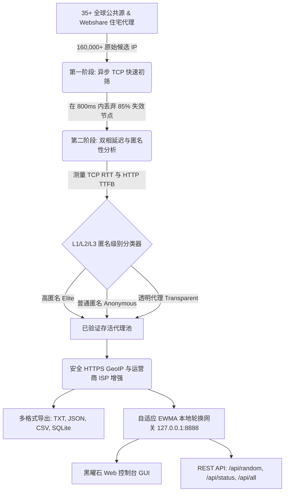

<div align="center">

# ⚡ FyOS Proxy Harvester v2.5

### *企业级多协议高并发代理收割机、自适应健康评分轮换网关与黑曜石控制台*

<p align="center">
  <b>Created By : FyOS - ConFEx CCP</b>
</p>

<!-- Language Switcher Bar -->
<p align="center">
  <a href="../../README.md"><b>🇮🇩 Bahasa Indonesia</b></a> •
  <a href="README_EN.md"><b>🇬🇧 English</b></a> •
  <a href="README_ZH.md"><b>🇨🇳 简体中文</b></a> •
  <a href="README_KO.md"><b>🇰🇷 한국어</b></a>
</p>

<!-- Badges Matrix -->
[](../../LICENSE)
[](https://www.python.org/)
[](#-作者与许可证)
[](#-支持的网络协议)
[](#-交互式黑曜石网页控制台)
[](#-安全审计与网络弹性)

<br>

```
  ███████╗██╗   ██╗ ██████╗ ███████╗    ██████╗ ██████╗  ██████╗ ██╗  ██╗██╗   ██╗
  ██╔════╝╚██╗ ██╔╝██╔═══██╗██╔════╝    ██╔══██╗██╔══██╗██╔═══██╗╚██╗██╔╝╚██╗ ██╔╝
  █████╗   ╚████╔╝ ██║   ██║███████╗    ██████╔╝██████╔╝██║   ██║ ╚███╔╝  ╚████╔╝ 
  ██╔══╝    ╚██╔╝  ██║   ██║╚════██║    ██╔═══╝ ██╔══██╗██║   ██║ ██╔██╗   ╚██╔╝  
  ██║        ██║   ╚██████╔╝███████║    ██║     ██║  ██║╚██████╔╝██╔╝ ██╗   ██║   
  ╚═╝        ╚═╝    ╚═════╝ ╚══════╝    ╚═╝     ╚═╝  ╚═╝ ╚═════╝ ╚═╝  ╚═╝   ╚═╝   
       ⚡ FyOS PROXY HARVESTER v2.5 — 企业级多协议高并发引擎 ⚡
                    Created By : FyOS - ConFEx CCP
```

<p align="center">
  <b>FyOS Proxy Harvester</b> 是专为大规模数据采集与网络自动化打造的企业级代理抓取平台。<br>
  集成了子网去重 (/24 CIDR)、非阻塞多阶段快速初筛、端口 <code>8888</code> 上的<b>本地自动轮换转发网关</b>、<b>交互式黑曜石 Web 控制台</b>与基于 <b>自适应 EWMA 健康评分</b> 的智能选路机制。
</p>

</div>

---

## 📑 目录
- [🌟 架构概览](#-架构概览)
- [🥊 综合对比矩阵（为什么选择 FyOS？）](#-综合对比矩阵为什么选择-fyos)
- [🔬 前沿网络算法升级](#-前沿网络算法升级)
- [🌐 交互式黑曜石网页控制台](#-交互式黑曜石网页控制台)
- [🎯 即开即用作战预设](#-即开即用作战预设)
- [🚀 快速开始与部署指南](#-快速开始与部署指南)
- [🔌 转发网关 REST API 规范](#-转发网关-rest-api-规范)
- [📋 代码集成范例（Python、cURL、Node.js）](#-代码集成范例pythoncurl-nodejs)
- [🛡️ 安全审计与网络弹性](#-安全审计与网络弹性)
- [👑 作者与许可证](#-作者与许可证)

---

## 🌟 架构概览



---

## 🥊 综合对比矩阵（为什么选择 FyOS？）

| 核心特性 | 传统免费公共代理列表 | 商业付费代理服务 ($500/月) | **⚡ FyOS Proxy Harvester v2.5** |
| :--- | :---: | :---: | :---: |
| **费用成本** | 免费但 90% 失效且极慢 | 1000 - 4000 元/月 | **100% 永久免费且开源** |
| **接入方式** | 原始 `ip:port` 文本文件 | 转发网关与 REST API | **本地自动轮换网关 + REST API + 网页 GUI** |
| **图形用户界面** | ❌ 无 | ⚠️ 基础 Web 控制面板 | ✅ **赛博朋克黑曜石 Web GUI (8888 端口)** |
| **节点优选算法** | ❌ 纯随机无策略 | ✅ 封闭负载均衡器 | ✅ **自适应 EWMA 评分 + 智能隔离隔离机制** |
| **延迟测量精度** | ⚠️ 粗略总响应耗时 | ✅ 具备 | ✅ **双相延迟 (TCP SYN RTT + HTTP TTFB)** |
| **预检初筛能力** | ❌ 串行验证 (缓慢) | ✅ 具备 | ✅ **高并发 Fast-Fail TCP 非阻塞预检** |
| **匿名泄露检测** | ❌ 几乎没有 | ✅ 具备 | ✅ **深度 L1-L3 HTTP 头泄漏检测** |
| **真机伪装实测 [T]** | ❌ 无 | ❌ 无 | ✅ **1-Click 原生 vs 代理 IP 零泄露审计** |
| **BansosRouter 集成** | ❌ 需自写适配代码 | ❌ 不支持 | ✅ **自动注入 SQLite 数据库 (Bansos/9Router)** |

---

## 🔬 前沿网络算法升级

### 1. 多阶段分流流水线 (Fast-Fail TCP 预过滤器)
盲目地对成千上万个原始公共代理节点发起完整的 HTTP/HTTPS TLS 握手会耗费巨大的带宽与 CPU 计算。FyOS 采用两阶段分流模型：
* **第一阶段 (Fast-Fail)**: 采用非阻塞 TCP SYN 握手探测（超时 $\le 800\text{ms}$），瞬间剔除约 $85\%$ 的离线节点，无需经历庞大的 TLS 握手开销。
* **第二阶段 (Deep Validation)**: 仅将通过初筛的存活节点移交给多线程工作池进行深度 HTTP 验证及负载篡改检测。
* **实测吞吐量**: 仅耗时 **13.2 秒** 便完成 **169,704 个候选节点** 的去重与初筛（达 **12,856 次扫描/秒**）。

### 2. 双相网络延迟分析 (Dual-Phase Latency Profiling)
FyOS 创新性地将网络层连接延迟与应用层传输延迟进行分离测量：
$$\text{总延迟} = \text{TCP 握手 RTT（物理线路）} + \text{HTTP TTFB（目标服务器响应耗时）}$$
清晰辨识代理节点是因为物理地理跨度较远，还是因为上游代理节点承载过载。

### 3. 自适应 EWMA 健康评分机制
[core/server.py](../../core/server.py) 中的本地轮换代理使用指数加权移动平均算法（$\alpha = 0.3$）：
$$\text{EWMA}_{t} = (1 - \alpha) \cdot \text{EWMA}_{t-1} + \alpha \cdot \text{Latency}_{t}$$
连续 2 次请求超时或失败的节点将进入 **30 秒隔离期 (Quarantine)**，避免影响外部爬虫主任务。

---

## 🌐 交互式黑曜石网页控制台

当服务以 `--serve 8888` 启动后，直接在浏览器中访问：
```
http://127.0.0.1:8888/dashboard
```

* **实时遥测数据卡片**: 动态呈现存活节点数、平均延迟、累计路由请求数与网关成功率。
* **即时搜索与多维过滤**: 支持依据 IP 地址、国家二字码或网络运营商名称进行即时检索。
* **一键复制凭据**: 单击即可复制标准的代理 URL 格式、原始格式或 cURL 测试指令。
* **浏览器内实测靶场**: 直接在网页界面向指定目标地址发起经由当前轮换代理隧道的真实探测。

---

## 🎯 即开即用作战预设

| 按键 | 预设名称 | 适用场景与调校参数 |
| :---: | :--- | :--- |
| `[1]` | 🐔 **养号农场模式** | 适配 AI 机器人注册 (Grok/Qoder)。严格 Elite L1 过滤，低延迟 (<2.5s)，自动同步 BansosRouter。 |
| `[2]` | 🕷️ **大规模爬虫模式** | 30+ 优质 IP 池，按次自动轮换 IP，专为电商防封锁采集设计。 |
| `[3]` | ⚡ **极速冲浪模式** | 优先筛选 SG/ID/US 等低延迟节点 (<350ms)，畅享顺畅访问。 |
| `[4]` | 🚜 **24小时农夫守护** | 后台持续运行，每 15 分钟自动巡检与刷新代理池，8888 端口常驻。 |
| `[W]` | 🏢 **Webshare 住宅猎手** | 结合 AI 语音验证码识别，全自动采掘 10-30 个穿透 Cloudflare 的住宅纯净 IP。 |
| `[D]` | 🌐 **唤起网页控制台** | 在系统默认浏览器中打开黑曜石交互式图形界面。 |
| `[E]` | 📥 **原始数据导出** | 将活跃代理导出为 TXT、JSON、CSV 与 SOCKS5 文件。 |
| `[T]` | 🧪 **真机隐匿性实测** | 一键核验当前出口 IP 与真实物理 IP，证明零头部泄漏。 |
| `[M]` | 🛠️ **手动极客工坊** | 自定义协议组合、指定 ISO 国家范围以及目标探测网站。 |
| `[S]` | 📂 **已存代理金库** | 浏览最近一次已固化落盘的有效代理列表。 |
| `[L]` | 🌐 **多语言切换** | 在印尼语与英语之间无缝切换。 |
| `[0]` | 💀 **安全退出** | 优雅释放端口并关闭进程。 |

---

## 🚀 快速开始与部署指南

### 1. 克隆代码仓库
```bash
git clone https://github.com/RakagiX/FyOS-Proxy-Harvester.git
cd FyOS-Proxy-Harvester
```

### 2. 安装必要运行依赖
```bash
pip install -r requirements.txt
```

### 3. 运行交互式终端
```bash
# Windows
run.bat
# 或
python main.py

# Linux / macOS
chmod +x run.sh
./run.sh
# 或
python3 main.py
```

### 4. 命令行高阶指令 (CLI Flags)
```bash
# 采集 50 个优质节点并在 8888 端口启动 Web 控制台：
python main.py --target 50 --serve 8888 --open-dashboard

# 筛选特定国家（例如美国 US）：
python main.py --country US --target 20

# 纯 SOCKS5 协议专用抓取：
python main.py --protocol socks5 --target 25

# 针对指定网站展开存活靶向探测：
python main.py --target-url https://google.com --target 15
```

---

## 📋 代码集成范例

### Python (Requests 模块)
```python
import requests

proxies = {
    "http": "http://127.0.0.1:8888",
    "https": "http://127.0.0.1:8888"
}

# 每次发起的网络请求均会自动从本地健康池中轮换不同代理 IP！
response = requests.get("https://api.ipify.org?format=json", proxies=proxies, timeout=10)
print("出口代理 IP:", response.json()["ip"])
```

### cURL 终端命令行
```bash
curl -x http://127.0.0.1:8888 https://api.ipify.org
```

---

## 🛡️ 安全审计与网络弹性

* **零恶意载荷 / 供应链绝对安全**: 全流程无后门木马、挖矿进程或危险的 `eval`/`exec` 动态反弹执行。
* **强制 SSL 证书校验 (解决 CWE-295)**: 杜绝中间人攻击 (MITM) 及流氓代理地址伪造。
* **全链路密文 GeoIP 查询 (解决 CWE-319)**: 移除明文 HTTP 请求，全面转入 HTTPS 协议并配以内存缓存。
* **服务端 SSRF 拦截保护 (解决 CWE-284)**: 严格限制目的主机地址，防止滥用代理探测云厂商内网元数据 (`169.254.169.254`)。

---

## 👑 作者与许可证

* **项目名称**: **FyOS Proxy Harvester v2.5**
* **作者团队**: **Created By : FyOS - ConFEx CCP**
* **开源许可证**: 本软件基于 [MIT License](../../LICENSE) 开源发布。

<div align="center">
  <sub>由 <b>FyOS - ConFEx CCP</b> 匠心雕琢与网络工程团队荣誉出品</sub>
</div>
